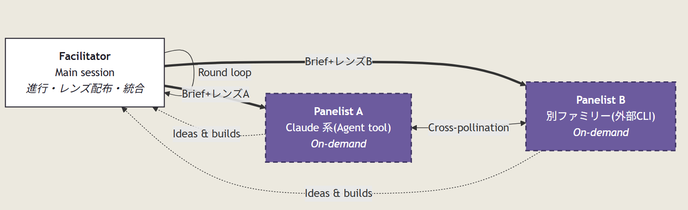
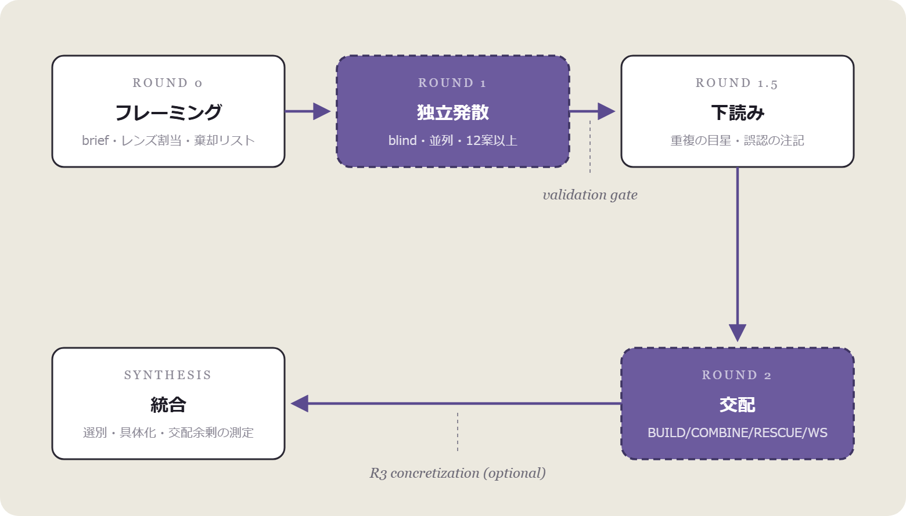

**English** | [日本語](README.ja.md)

# collaborative-panel

A Claude Code skill for **multi-model collaborative brainstorming** — the cooperative sibling of [adversarial-panel](https://github.com/makinux/adversarial-panel). Multiple models generate ideas independently under different method lenses, cross-pollinate each other's idea sets (build on / combine / rescue / fill white space), and a facilitator converges the union into a ranked, testable shortlist — keeping the weird ideas alive instead of sanding them off.

## Why

Adversarial review kills what is wrong; it puts nothing in the empty seat. Verification asymmetry — spotting flaws is easier than creating — has an easy side, and no new option ever comes out of it. Generation remains someone's job.

The naive fix fails quietly. Give the same open question to two models and you get two heavily overlapping sets of the obvious first five ideas. Crossing model families barely helps — heterogeneity decorrelates **errors**, not **ideation**. Critique aims at an external target (the other's claims); ideation aims inward, at defaults that are dented the same way in every model.

So "asking several models for ideas" is worth nothing as such. Three engineered properties do the actual work:

- **Decorrelated divergence** — a blind Round 1 plus a different *method lens* per panelist. Anchoring is the collaborative analog of the shared blind spot: a panelist who has seen another's ideas produces variations, not new regions.
- **Combination surplus** — the ideas neither panelist would produce alone come from crossing one's Round-1 set with the other's. Left alone, models return praise and paraphrase, so Round 2 forces builds and combinations by count.
- **Convergence without mush** — forty raw ideas are not a deliverable, but blending them into themes destroys them. The facilitator selects and concretizes while keeping ideas atomic, attributed, and testable; wildcards live in a separate, unranked lane.

## Architecture



Same skeleton as adversarial-panel — what changes is what gets distributed and what gets demanded back. The facilitator (the main session) writes a self-contained brief and assigns each panelist 1–2 **method lenses**, all different: analogy transfer, inversion, stakeholder rotation, asset recombination, constraint shifting, scale shifting. Lenses, not model weights, are what decorrelate the ideation.

Panelists are recruited in **descending order of heterogeneity**, exactly as in adversarial-panel:

1. A different model family — an external CLI (e.g. Codex) via Bash
2. A different Claude model — via the Agent tool's `model` parameter
3. The same model with forced-divergent lenses

Unlike the adversarial facilitator, this one may contribute ideas of its own (it adjudicates nothing, so there is no conflict of interest) — always labeled, never crowding the panelists' lanes.

Default: **2 panelists × 2 rounds** — one round fewer than the adversarial default, because divergence needs no concede-and-defend round.

## Protocol



White = facilitator's job, purple = panelists' job.

| Round | What happens |
|---|---|
| **Round 0** | Write a self-contained brief: seed, goal, evaluation axes, a fixed 4-line idea format, a **quantity floor** (≥12 ideas each, plus a self-marked wildcard and sleeper), and a **dead-claims list** (claims a prior review killed may not be resurrected as stated — attacking their premise via a genuinely new mechanism is allowed). Never enumerate the answer categories you expect (seed leakage) |
| **Round 1** | Launch all panelists blind and in parallel. Validation gate on every return: format, floor, and *actual use of the assigned lens* |
| **Round 1.5** | A minutes-long facilitator scan: mark near-duplicates, flag ideas built on factual errors (uncorrected, they poison every build on top), pick the ideas each panelist must engage with |
| **Round 2** | Swap the idea sets and demand contributions by type and count: **BUILD ≥5** (add something nameable), **COMBINE ≥2** (fuse two parents into a third idea), **RESCUE ≥1** (the only permitted form of criticism — find the version of the weakest idea that works), **WHITE SPACE ≥2**, **SELECT** top 5 with the cheapest next test for each |
| **Round 3** (optional) | One-pagers for the shortlist — high-stakes runs only |
| **Synthesis** | Deduplicate with a merge map (credit both originators), rank on the Round-0 axes, output four parts: ranked shortlist / unranked wildcards / named white space / cheapest tests. Name the **combination surplus** — ideas traceable to no single Round-1 set. If it is zero, say so: the panel ran as two parallel monologues |

No confidence percentages — attaching "70% confident" to an unvetted idea is calibration theater. Every idea ships with its **cheapest verification step** instead: what gets priced is not plausibility but the cost of finding out.

## Three invariants, protected throughout

| Invariant | Meaning |
|---|---|
| **Independence** | Round-1 divergence is blind. A panelist who has seen another's ideas produces variations, not new regions |
| **Additivity** | A Round-2 contribution must add mechanism, scale, pairing, or application. Agreement is fine; **empty** agreement is praise padding and counts as a failed contribution |
| **Hypothesis labeling** | Brainstorm output is unvetted by design. Every idea carries its cheapest verification step and is never dressed as a validated claim |

## Installation

Drop [SKILL.md](SKILL.md) into:

```
~/.claude/skills/collaborative-panel/SKILL.md
```

(On Windows: `%USERPROFILE%\.claude\skills\collaborative-panel\SKILL.md`.)

```powershell
# Windows (PowerShell)
New-Item -ItemType Directory -Force "$env:USERPROFILE\.claude\skills\collaborative-panel"
Invoke-WebRequest https://raw.githubusercontent.com/makinux/collaborative-panel/main/SKILL.md -OutFile "$env:USERPROFILE\.claude\skills\collaborative-panel\SKILL.md"
```

```bash
# macOS / Linux
mkdir -p ~/.claude/skills/collaborative-panel
curl -o ~/.claude/skills/collaborative-panel/SKILL.md https://raw.githubusercontent.com/makinux/collaborative-panel/main/SKILL.md
```

## Usage

Besides explicit invocation, it fires on natural phrases like:

> "Brainstorm this with multiple models" / "What else could we add?" / "Build on this"
> 「このアイディアを膨らませて」「加算事項を出して」「協調的パネルで」

It is built for situations short on **options, not verdicts** — additions to an existing proposal, alternatives for a stuck design, refilling a chapter a review has hollowed out. Do not open it on questions of whether a claim is true: it returns hypotheses only. That is adversarial-panel's job.

The two skills are designed to chain: **diverge → harden** (feed the shortlist to adversarial-panel), or the reverse (kill first, then refill). Either way the connector is the dead-claims list — without it, the later brainstorm politely reinvents what the earlier review just refuted.

## Correspondence with adversarial-panel

| | adversarial-panel | collaborative-panel |
|---|---|---|
| Goal | survival of claims | coverage of the idea space |
| Round 1 | independent answers | independent divergence + lenses |
| Round 2 | cross-critique | cross-pollination (BUILD / COMBINE / RESCUE / WS) |
| Forbidden | agreement without arguments | praise without additions |
| Criticism | the point | permitted only as RESCUE |
| Failure equilibrium | sycophantic convergence | parallel monologues (zero surplus) |
| Synthesis rule | no averaging | no blending |
| Output pricing | confidence + falsification condition | cheapest verification step |
| **Unanimity means** | (cross-family) strong evidence | **redundancy — a coverage failure** |

The last row is the deepest difference: the same "everyone agrees" reads as evidence in one skill and as a failure indicator in the other.

## Failure modes engineered against

- **Anchoring leak** — anyone sees another's ideas before finishing Round 1; from that point on it produces variations, not new regions
- **Obvious first five** — no floor, no lenses → both panelists return the same five ideas; convergence here is redundancy, not validation
- **Praise padding** — Round-2 "builds" that restate or compliment → count only contributions that add something nameable
- **Feasibility theater** — presenting brainstorm output as vetted → every idea ships with a cheapest test
- **Convergent mush** — synthesis that blends ideas into themes ("leverage synergies…") instead of keeping them atomic and actionable
- **Seed leakage** — the facilitator's expected categories in the brief, echoed back as false coverage
- **Killed-claim resurrection** — re-proposing what a prior review already refuted, in its refuted form
- **Novelty worship** — ranking by surprise alone; an idea that ignores context fit is a different proposal, not a good one

## License

[MIT](LICENSE)

## Credits

Concept & design: [@wayama_ryousuke](https://x.com/wayama_ryousuke) (designed as the cooperative sibling of [adversarial-panel](https://github.com/makinux/adversarial-panel); refined in a back-and-forth with Claude Opus)
